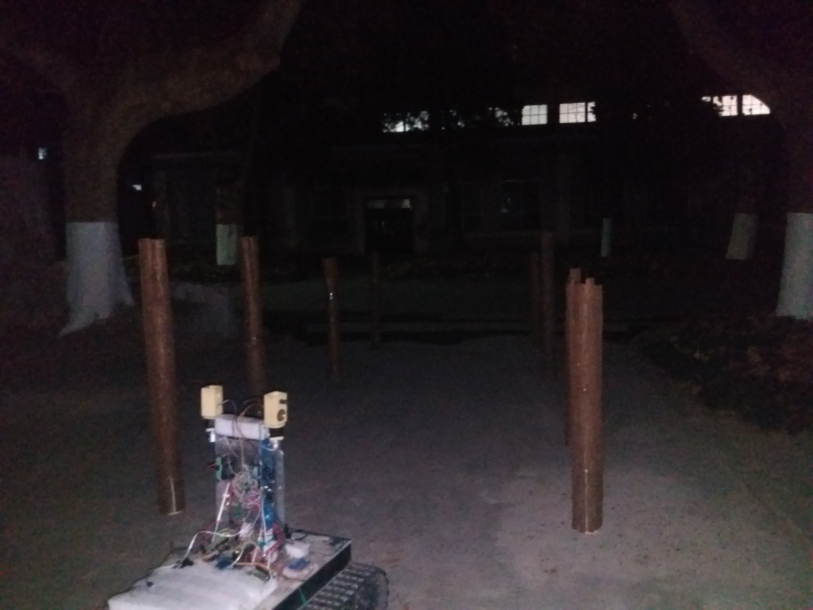

# OrchardRover

2020.6.4 返校后修改之前的代码

A navigation system for orchard robot.

OrchardRover 是一套基于 ROS 开发的果园移动机器人 SLAM 系统。此外，本项目还编写了机器人的下位机程序 [OrchardRoverFirmWare](https://github.com/1344618323/OrchardRoverFirmWare) 

目前的方案
* 建立以树干坐标表征的二维果园地图
* 传感器：单目相机 + 激光雷达 + 底盘里程计（下位机解算）
* 使用 CNN 检测图像中的树干，并结合雷达数据计算树干相对机器人的方位
* 使用 Fastslam1.0 实现机器人的即时定位与建图

评价与改进：
* Fastslam 有粒子耗散的缺陷，在实际大环境中，输出的地图会越来越偏，虽然本项目使用了 gmapping 中的方法降低了重采样的频率，但理论上依然比不过基于图优化的 slam 方法
* 计划使用图优化的方法改进，如 双目 + Bundle Adjustment

软件环境：Ros kinetic & C++

软件包简介
* or_base：	    Pc与Stm32的通讯包
* or_bringup：   常用launch启动文件，包括 Ros Stage 仿真的配置文件	
* or_detection： CNN 树干检测
* or_slam：      Fastslam1.0 算法实现

## 仿真效果

在 Stage 仿真中使用100个粒子建图，经过重采样后，粒子集的地图趋于收敛

* 红色粒子：机器人位姿粒子集
* 黑色菱形：树干真实坐标
* 蓝色方块：粒子集地图，所有粒子的地图都会绘制

## 实机效果

CNN 树干检测

---

真实环境 SLAM 效果

<video id="video" controls="" preload="none"
    poster="http://media.w3.org/2010/05/sintel/poster.png">
    <source id="ogv" src="img/slam_true.ogv" 
              type="video/ogg">
    
Your user agent does not support the HTML5 Video element.

</video>

在这个真实环境中，共有8棵树干，分两行排列，树的间隔为2～2.5m。