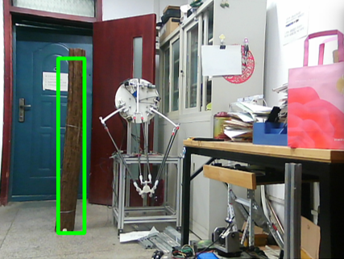

# OrchardRover
A navigation system for orchard robot.
OrchardRover 是一套基于 ROS 开发的果园移动机器人 SLAM 系统。此外，本项目还编写了机器人的下位机程序 [OrchardRoverFirmWare](https://github.com/1344618323/OrchardRoverFirmWare) 

目前的方案
* 建立以树干坐标表征的二维果园地图
* 传感器：单目相机 + 激光雷达 + 底盘里程计（下位机解算） + GPS
* 使用 CNN 检测图像中的树干，并结合雷达数据计算树干相对机器人的方位（要对雷达与相机做外参标定）
* 基于图优化的slam方法

* slam部分
```
模拟器：树干的坐标已知，机器人观测角度是(-60~60)，距离5m以内，只要树干在其观测范围内，就返回最近的雷达数据，若距离不符合，就认为是障碍物
真实车：标定雷达与相机，将雷达点(x,y)投影到(u,v)的u上 -> map(u,(x,y))。 
最大似然：所有树干坐标(xi,yi)，观测值(x,y)，(xi-x)^2+(yi-x)^2最小的那个就是观测树干，我们设置协方差为[0.3,0.3]；若最小值都无法通过卡方检验5.99，我们就认为碰到新树干了，加树顶点
每次收到雷达信息，且odom移动超过0.2m，5度，我们就加车顶点，并优化一次
车顶点-车顶点 odom测出的变换
车顶点-树顶点 雷达测出的变换 旋转权重为0
gps：Tgps_node'，Tglobal_node'插值得到，优化Tglobal_gps顶点、两个node顶点。
	初始(经纬度、海拔)->Tlocal_ECEF,之后得到的gps数据为Pecef，有Tlocal_ECEF×Pecef=Plocal，也就是Tgps_node'
```

* 定位部分
```
图优化：树干坐标固定，只优化最新的5个机器人位姿顶点
gps,延用slam中的Tlocal_ECEF，这样就能得到Tgps_node'了，
并用slam中优化出来的Tglobal_gps，就可以得到对应的Tglobal_node'了
```

* 规划部分
```
costmap：全局分辨率0.5m+局部0.1m
全局 A*
局部 Teb
```


软件环境：Ros kinetic & C++

软件包简介
* or_base：	    Pc与Stm32的通讯包
* or_bringup：   常用launch启动文件，包括 Ros Stage 仿真的配置文件	
* or_detection： CNN 树干检测
* or_slam：      图优化实现、Fastslam1.0 算法实现
* or_lasercamcal： 相机雷达外参标定（[旷世开源的标定程序](https://github.com/MegviiRobot/CamLaserCalibraTool)）

## 使用指令

*串口内容：
```
cd /etc/udev/rules.d
车子：
KERNEL=="ttyUSB*", ATTRS{idVendor}=="1a86", ATTRS{idProduct}=="7523", MODE:="0777", SYMLINK+="or_7523_serial"
213测试设备：
KERNEL=="ttyUSB*", ATTRS{idVendor}=="10c4", ATTRS{idProduct}=="ea60", MODE:="0777", SYMLINK+="or_7523_serial"
```
* 仅开启相机

roslaunch hk_camera hk_camera_show.launch （hk包中config调整是否可视化结果、调整曝光）


* 树干方位感知：

roslaunch or_bringup trunk_position_online.launch  （detection包中config可调整是否使用雷达、是否可视化结果。引用了上一个launch，因此无法调整是否查看原图）

* 开启相机雷达里程计

roslaunch or_bringup bag.launch 

* 录制数据：

rosbag record /scan /usb_cam/image_raw /tf 

* 串口：

roslaunch or_bringup or_base.launch

底盘速度控制：[0.3,0.5]

* 看tf:

rosrun rqt_tf_tree rqt_tf_tree

rosrun tf tf_echo odom base_link

* 记录planning

rosbag record /global_costmap/global_costmap/costmap /global_planner_node/path /map /local_costmap/local_costmap/costmap /local_costmap/local_costmap/footprint /local_planner_node/trajectory /tf /cmd_vel 


## 仿真效果
### 图优化效果


### 老版本fastslam效果
在 Stage 仿真中使用100个粒子建图，经过重采样后，粒子集的地图趋于收敛

* 红色粒子：机器人位姿粒子集
* 黑色菱形：树干真实坐标
* 蓝色方块：粒子集地图，所有粒子的地图都会绘制

### 运动规划
mp4视频
<video id="video" controls="" preload="none" poster="poster.png">
      <source id="mp4" src="img/运动规划.mp4" type="video/mp4">
      </video>

## CNN 树干检测
